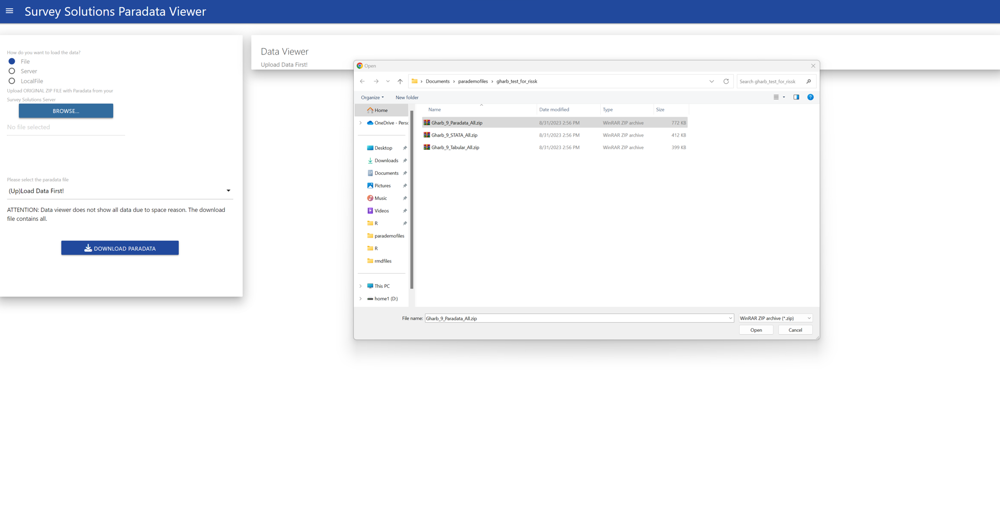

```{r, include = FALSE}
knitr::opts_chunk$set(
  collapse = TRUE, 
  tidy=TRUE,
  comment = "#>",
  eval=FALSE, echo=TRUE,
  out.width = "50%"
)
```

```{css, echo=FALSE}
.figcaption {
  text-align: center;
}

p {
  text-align: justify !important;
}

```

## Running the application

After successful installation of the susoparaviewer package, you just need to run the following two commands to start the application:


```{r setup}
library(susoparaviewer)
runParaApp()

```


This will start the application in your default browser, and by using the leaflet package for maps. In case you want to use the R mapdeck package, which requires a Mapbox API key, you can just set the *mapwidget.option* to mapdeck:


```{r setup_mapdeck}
library(susoparaviewer)
runParaApp(mapwidget.option = "mapdeck")

```


That's all there is, to run the application in interactive mode. To run it on a shiny server please read the corresponding vignette.

## Using the application


After running above commands, your browser will show the following start-up dialogue:


{width=100%}


When using the leaflet map widget, only the user name is required, and will be used to create your personal working directory in you system.

The next step is to load the data. This can be done in three different ways. Either by uploading the paradata file as exported from the Survey Solutions server (without modification!), by connecting to your Survey Solutions server through the API (requires an API user!) or by loading already imported files from the local directory. Since we assume you start from a clean installation, I will first show how to upload the file:


{width=100%}

You only need to select the paradata file, no other file is required at this stage. When the file is loaded, a modal dialogue will appear and request to determine the GPS variable:


{width=100%}

If there is no GPS variable in your data set, just select none. Be aware, that in this case maps and the map report can not be generated.

After you have selected the variable, the data will be loaded and presented on the screen:


{width=100%}

On this screen you can also download the data by individual event. or review it in the browser table by table.

After loading the data you can review the included graphs, to do so, switch to the graph tab:


{width=100%}


On the plots page there are three additional tabs, Questionnaire, Interviewer and Map. Each produces different types of plots, as well as allows you to download a report in MS Word format.


{width=100%}


<br><br>


{width=100%}


<br><br>


{width=100%}


